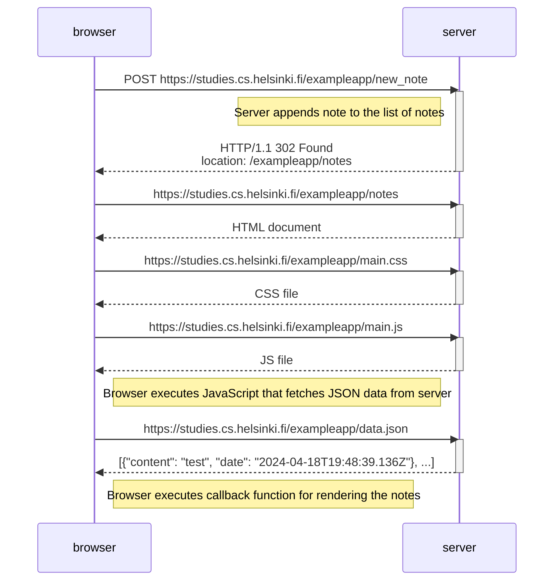

# Tehtävä 0.1

```mermaid
sequenceDiagram
  participant browser
  participant server

  browser->>server: POST https://studies.cs.helsinki.fi/exampleapp/new_note
  activate server
  Note left of server: Server appends note to the list of notes
  server-->> browser: HTTP/1.1 302 Found <br> location: /exampleapp/notes
  deactivate server

  browser->>server: https://studies.cs.helsinki.fi/exampleapp/notes
  activate server
  server-->>browser: HTML document
  deactivate server

  browser->>server: https://studies.cs.helsinki.fi/exampleapp/main.css
  activate server
  server-->>browser: CSS file
  deactivate server

  browser->>server: https://studies.cs.helsinki.fi/exampleapp/main.js
  activate server
  server-->>browser: JS file
  deactivate server

  Note right of browser: Browser executes JavaScript that fetches JSON data from server

  browser->>server: https://studies.cs.helsinki.fi/exampleapp/data.json
  activate server
  server-->>browser: [{"content": "test", "date": "2024-04-18T19:48:39.136Z"}, ...]
  deactivate server

  Note right of browser: Browser executes callback function for rendering the notes
```
