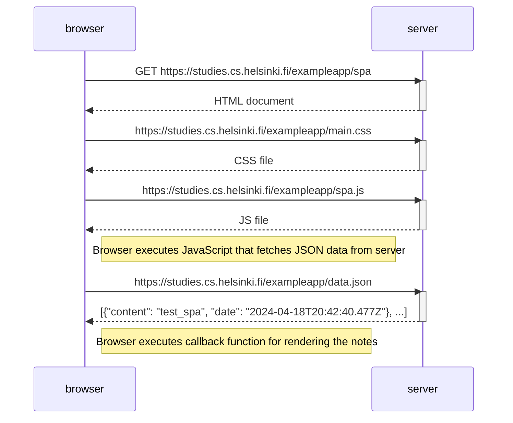

# Tehtävä 0.5

```mermaid
sequenceDiagram
  participant browser
  participant server

  browser->>server: GET https://studies.cs.helsinki.fi/exampleapp/spa
  activate server
  server-->> browser: HTML document
  deactivate server

  browser->>server: https://studies.cs.helsinki.fi/exampleapp/main.css
  activate server
  server-->>browser: CSS file
  deactivate server

  browser->>server: https://studies.cs.helsinki.fi/exampleapp/spa.js
  activate server
  server-->>browser: JS file
  deactivate server

  Note right of browser: Browser executes JavaScript that fetches JSON data from server

  browser->>server: https://studies.cs.helsinki.fi/exampleapp/data.json
  activate server
  server-->>browser: [{"content": "test_spa", "date": "2024-04-18T20:42:40.477Z"}, ...]
  deactivate server

  Note right of browser: Browser executes callback function for rendering the notes
```
