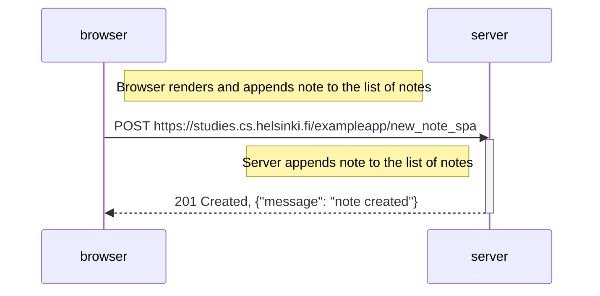

# Tehtävä 0.6

```mermaid
sequenceDiagram
  participant browser
  participant server

  Note right of browser: Browser renders and appends note to the list of notes

  browser->>server: POST https://studies.cs.helsinki.fi/exampleapp/new_note_spa
  activate server
  Note left of server: Server appends note to the list of notes
  server-->> browser: 201 Created, {"message": "note created"}
  deactivate server
```
